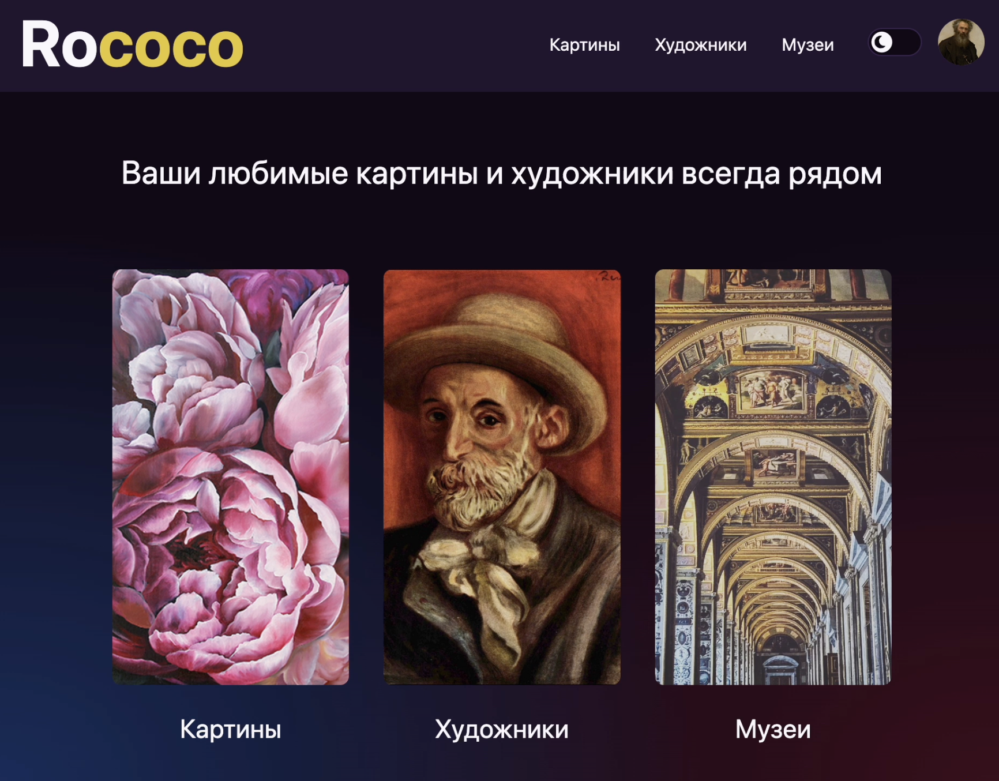
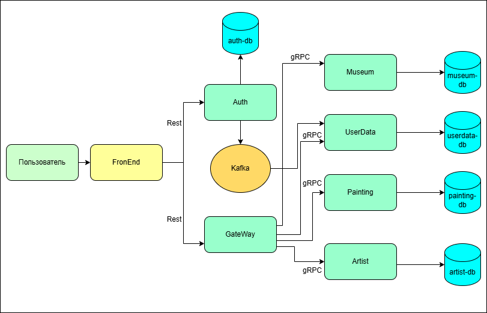

# Rococo

**Rococo** — приложение с микросервисной архитектурой, предназначенное для работы с художественной коллекцией: 
художники, картины, музеи, страны и пользователи.

Данное приложение построено на базе **Spring Boot + gRPC**, с API-шлюзом и валидацией данных на уровне **REST** и **gRPC**.



---

## Архитектура

Проект состоит из нескольких сервисов:

- **Gateway Service** — сервис для работы с HTTP запросами
- **Artist Service** — сервис для управления художниками
- **Painting Service** — управление картинами
- **Museum and Country Service** — управление музеями и использование списка стран
- **User Service** — пользовательский сервмс
- **Auth Service** — сервис для аутентификации и авторизации



---

##  Технологии, использованные в проекте

### Backend
- **Java 21**
- **Spring Boot**
- **Spring Web**
- **Spring Security**
- **Spring OAuth**
- **Spring Data JPA**
- **gRPC**

### DataBase
- **PostgreSQL**

### Infrastructure
- **Docker**
- **Docker Compose**
- **Apache Kafka**

### Testing
- **JUnit 5**
- **Retrofit**
- **Selenide**
- **Selenoid**
- **OkHttp3**
- **Mockito**

---

# Локальный запуск

> Необходимо установить: Docker, Java 21, Gradle, Node.js

### 1️⃣ Запуск фронтенда
Фронтенд будет доступен по локальному хосту на порту 3000: http://localhost:3000/

```bash
cd rococo-client
npm install
npm run dev
```

### 2️⃣ Запуск БД, Zookeeper и Kafka в Docker

Создаём Docker volume:

```bash
docker volume create pgdata
```

Команду нужно запускать в корне проекта
Для Windows используйте Bash terminal, например Git Bash
```bash
bash localenv.sh
```
### 3️⃣ Запуск сервисов через IntelliJ IDEA

Далее необходимо настроить все Spring-сервисы на профиль local,
после чего последовательно запустить:
- **rococo-auth**
- **rococo-gateway**
- **rococo-museum**
- **rococo-userdata**
- **rococo-painting**
- **rococo-artist**

# Запуск тестов и микросервисов в Docker

###   Запуск всех сервисов и тестов
```bash
 bash docker-compose-e2e.sh
```

В Docker запустятся 15 контейнеров:

rococo-all-db, zookeeper, kafka, auth.rococo.dc, gateway.rococo.dc, artist.rococo.dc, museum.rococo.dc, painting.rococo.dc, userdata.rococo.dc, frontend.rococo.dc, selenoid, selenoid-ui, rococo-e-2-e, allure, allure-ui.

Тесты будут выполняться в контейнере rococo-e-2-e

Результаты тестов доступны по адресу: http://allure:5252/

Фронтенд доступен по адресу: http://frontend.rococo.dc/